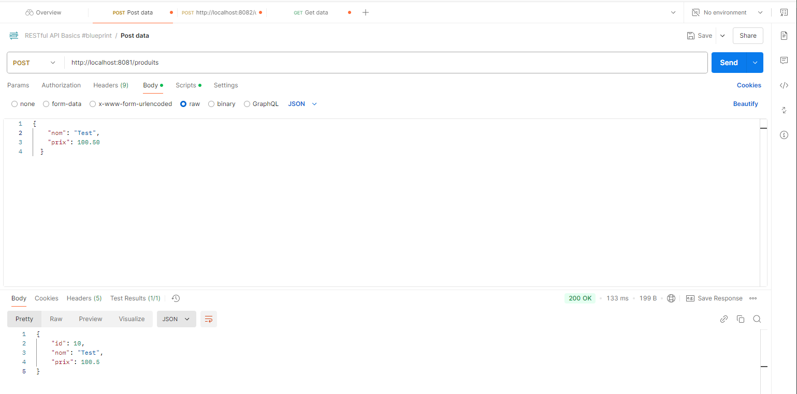
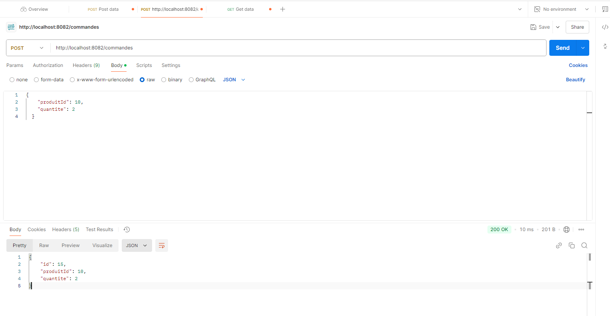
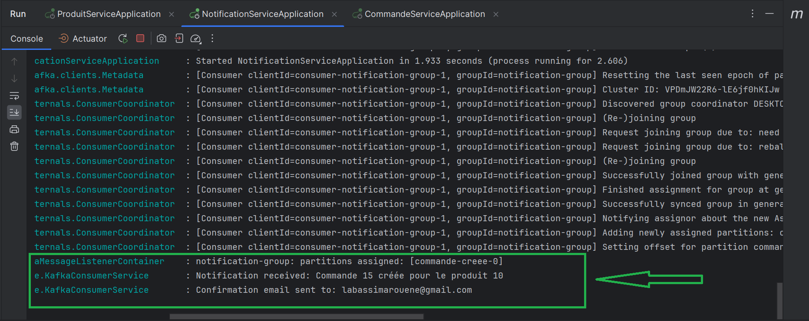
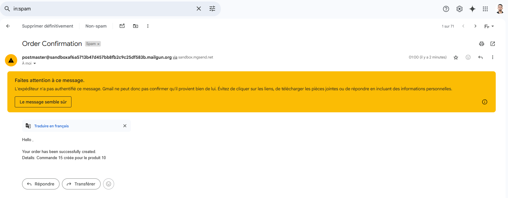

# Microservices Project: Commande, Notification, and Product Services

This project consists of three microservices:
- **Commande Service**: Manages orders.
- **Notification Service**: Sends email notifications for orders.
- **Product Service**: Handles product data.

It also integrates with Kafka for asynchronous communication.

---

## Prerequisites

1. **Java Development Kit (JDK)**: Ensure JDK 17 or later is installed.
2. **Apache Kafka**:
   - Download Kafka from the [official website](https://kafka.apache.org/downloads).
   - Extract the archive to a desired location.
3. **Maven**: Install Maven to build the project.
4. **Mailgun Account**: Set up a Mailgun account for email notifications.

---

## Kafka Setup (Local)

1. Navigate to your Kafka directory:
   ```bash
   cd /path/to/kafka
   ```

2. Start the Zookeeper server:
   ```bash
   bin/zookeeper-server-start.sh config/zookeeper.properties
   ```

3. Start the Kafka server:
   ```bash
   bin/kafka-server-start.sh config/server.properties
   ```

4. Create the required topic:
   ```bash
   bin/kafka-topics.sh --create --topic commande-creee --bootstrap-server localhost:9092 --partitions 1 --replication-factor 1
   ```

---

## Installation and Setup for Microservices

1. Clone the repository:
   ```bash
   git clone <repository-url>
   cd <repository-folder>
   ```

2. Build all services using Maven:
   ```bash
   mvn clean install
   ```

3. Configure application properties:
   - Update `application.yml` or `application.properties` in each service with your specific configurations (e.g., Mailgun credentials, Kafka settings).

---

## Starting the Services

1. Start the **Commande Service**:
   ```bash
   cd commande-service
   mvn spring-boot:run
   ```

2. Start the **Notification Service**:
   ```bash
   cd notification-service
   mvn spring-boot:run
   ```

3. Start the **Product Service**:
   ```bash
   cd product-service
   mvn spring-boot:run
   ```

---

## Testing the Application

1. Use tools like Postman or curl to test the APIs. Example requests are provided in the `api-tests` folder.
2. Upon placing an order, check your email inbox for notifications sent by the Notification Service.

### Sample Results

- API Testing Screenshots:
- Product
  
- Order
  

- Email Notification:
- Logs
  
- Email
  

---

## Troubleshooting

1. **Kafka Issues**:
   - Ensure Zookeeper and Kafka servers are running.
   - Verify the topic exists using:
     ```bash
     bin/kafka-topics.sh --list --bootstrap-server localhost:9092
     ```

2. **Email Not Sent**:
   - Check Mailgun credentials in the `notification-service` configuration.
   - Ensure the recipient email is authorized in your Mailgun account if using a sandbox domain.

---

## License

This project is licensed under the MIT License. See the LICENSE file for details.

---

Happy coding!
